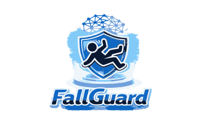
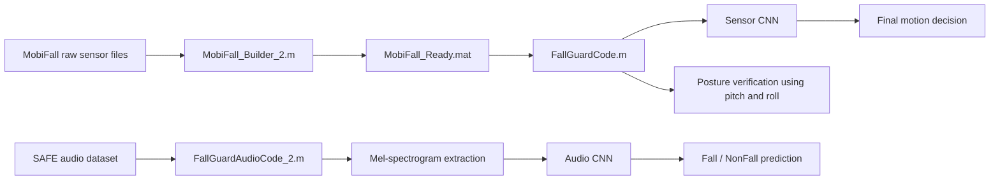

<p align="center">
  
</p>

<h1 align="center">FallGuard</h1>

<p align="center">
  Hybrid smartphone fall detection for AI competition demos using motion sensors, posture verification, and audio-based CNN classification.
</p>

<p align="center">
  
  
  
  
</p>

## Overview

**FallGuard** is our AI competition project for automatic fall detection using a smartphone-centered sensing pipeline.

The repository contains two main learning paths:

- a **sensor-based fall detection pipeline** built from motion signals such as acceleration, gyroscope, and orientation
- an **audio-based fall detection pipeline** that converts audio clips into mel-spectrograms and classifies **Fall** vs **NonFall**

The project is designed to be **demo-friendly**: it combines a neural network with a simple posture-based verification stage to reduce false alarms in practical smartphone scenarios.

---

## Why this project matters

Falls can become dangerous very quickly, especially when the person cannot call for help immediately. FallGuard is built around three practical ideas:

1. **Use the smartphone people already have**  
   No extra wearable hardware is required for the core sensing pipeline.

2. **Combine AI with physical reasoning**  
   The system does not rely only on a neural network. The motion pipeline also checks posture change to suppress suspicious false positives.

3. **Support multiple sensing channels**  
   Motion and audio can be explored as complementary paths for robust fall detection.

---

## Repository structure

```text
FallGuard/
├── audio/
│   └── FallGuardAudioCode_2.m
├── sensor/
│   ├── FallGuardCode.m
│   └── MobiFall_Builder_2.m
├── assets/
│   ├── banner.svg
│   └── screenshots/
│       ├── hero-placeholder.svg
│       ├── sensor-confusion-placeholder.svg
│       ├── audio-confusion-placeholder.svg
│       └── training-placeholder.svg
├── docs/
│   └── UPLOAD_GUIDE.md
├── README.md
└── .gitignore
```

---

## Pipeline summary



---

## What each file does

### `sensor/MobiFall_Builder_2.m`
Builds the motion dataset for training.

Main responsibilities:
- scans the MobiFall-style dataset directory
- groups accelerometer, gyroscope, and orientation files by trial
- resamples all sensors to a **fixed uniform timeline**
- extracts **256-sample windows**
- stores:
  - `XCNN` for CNN training
  - `XRaw` for raw posture-based heuristics
  - `Y_Categorical` labels
- saves everything into `MobiFall_Ready.mat`

### `sensor/FallGuardCode.m`
Main sensor training and validation script.

Main responsibilities:
- loads `MobiFall_Ready.mat`
- creates an **80/20 train-validation split**
- trains the motion network
- applies a **posture verification heuristic** based on pitch and roll
- plots the final confusion matrix
- computes normalization statistics for Android deployment

> **Important:** this script calls `Network;` at the beginning.  
> Add `Network.m` to the repository if you want other users to run the motion model directly.

### `audio/FallGuardAudioCode_2.m`
Main audio training and evaluation script.

Main responsibilities:
- loads a SAFE-style audio dataset folder
- parses filenames into labels and folds
- performs a **strict fold split** for train / validation / test
- extracts **mel-spectrogram** features
- trains a CNN for **Fall vs NonFall**
- evaluates on a held-out test set
- saves the trained model to `SAFE_AudioCNN_Model.mat`

---

## Demo visuals

### Project / app overview
<p align="center">
  
</p>

### Sensor pipeline result
<p align="center">
  
</p>

### Audio pipeline result
<p align="center">
  
</p>

### Training / build screenshots
<p align="center">
  
</p>

> Replace the placeholder SVG files with your real screenshots before the final competition submission or public release.

---

## Quick start

### 1) Sensor pipeline

Prepare your MobiFall-style dataset and place the files where the builder can access them.

Run:

```matlab
cd sensor
MobiFall_Builder_2
FallGuardCode
```

Expected output:
- `MobiFall_Ready.mat`
- trained motion model in memory
- confusion matrix for the validation split
- printed normalization constants for Android integration

### 2) Audio pipeline

Prepare the SAFE audio dataset in a folder named:

```text
FallGuardAudio/
```

Then run:

```matlab
cd audio
FallGuardAudioCode_2
```

Expected output:
- audio CNN training progress
- held-out test accuracy
- confusion matrix
- `SAFE_AudioCNN_Model.mat`

---

## Datasets

This repository is structured around two data sources:

### Motion dataset
The motion pipeline expects a **MobiFall-style** directory of text files containing:
- accelerometer
- gyroscope
- orientation data

### Audio dataset
The audio pipeline expects a SAFE-style audio folder with filenames following the pattern:

```text
AA-BBB-CC-DDD-FF.wav
```

where:
- `AA` = fold ID
- `FF` = class ID
- `01` = Fall
- `02` = NonFall

> For privacy, storage, and licensing reasons, datasets may be kept outside the public repository.

---

## Method highlights

### Motion branch
- fixed-rate sensor synchronization
- window extraction for fall and ADL samples
- CNN-based classification
- auxiliary pitch/roll posture verification
- Android-friendly normalization export

### Audio branch
- mel-spectrogram front-end
- fold-based split to reduce leakage
- compact CNN for binary audio classification
- test-time confusion matrix for clear demo presentation

---

## Android / deployment note

The motion training script prints `MAT_MEAN` and `MAT_STD` arrays formatted for direct use in Android Studio.  
That makes it easier to keep preprocessing consistent between MATLAB training and mobile inference.

---

## Recommended screenshots to add

For the strongest GitHub presentation, replace the placeholders with:

- `assets/screenshots/demo-app.png`
- `assets/screenshots/sensor-confusion-matrix.png`
- `assets/screenshots/audio-confusion-matrix.png`
- `assets/screenshots/training-progress.png`
- `assets/screenshots/pipeline-overview.png`

---

## Professional GitHub setup checklist

- add a short repository description
- add GitHub topics such as `fall-detection`, `matlab`, `cnn`, `android`, `audio-classification`
- upload real screenshots
- add `Network.m` if it can be shared
- create a `v1.0.0` release
- pin the repository on your profile

A full upload guide is included here:

**[`docs/UPLOAD_GUIDE.md`](docs/UPLOAD_GUIDE.md)**

---

## Suggested repository description

> Hybrid smartphone fall detection system using motion sensors, posture verification, and audio-based CNN classification.

---

## Suggested citation / project note

If you use or adapt this repository, please cite the project or reference the competition team appropriately.

```bibtex
@misc{fallguard2026,
  title        = {FallGuard: Hybrid Smartphone Fall Detection Using Motion and Audio Pipelines},
  author       = {Ridma Ganganath and team},
  year         = {2026},
  note         = {AI competition project repository}
}
```

---

## License

Add a license before public release if needed.  
For a simple open repository, `MIT License` is a common choice.

---

## Acknowledgment

Built as part of an AI competition project focused on practical, accessible fall detection using everyday devices.
